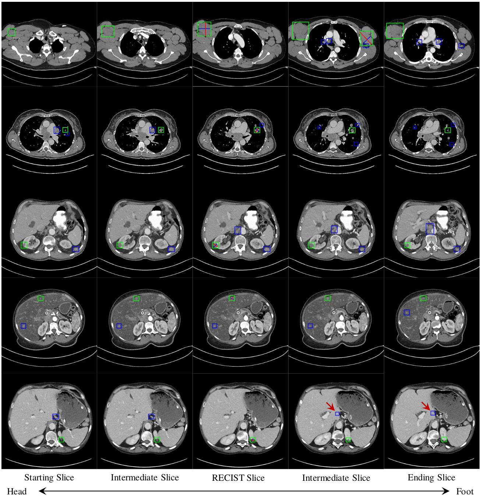

# Lesion Harvester on DeepLesion

## Introduction
To harvest lesions from the [DeepLesion](https://nihcc.app.box.com/v/DeepLesion) [1] dataset, we randomly selected 844 volumes from the original 14075 training CT subvolumes. These are then annotated by a board-certified radiologist using 2D RECIST marks, which we converted to 2D bounding boxes. Of these, we selected 744 as $V_{M}$ (5.3%) and leave another 100 as an evaluation set for lesion harvesting. This latter subset, denoted $V_{H}^{test}$, is treated identically at $V_{H}$, meaning the algorithm only sees the original DeepLesion RECIST marks. After convergence, we can measure the precision and recall of the harvested lesions. 

In addition, we also annotated 1071 of the testing CT subvolumes of DeepLesion with 2D bounding boxes. We these to evaluate performance on systems trained with our harvested lesions. These volumes, denoted $V_{D}^{test}$, are never seen in our harvesting framework. Unlike the original DeepLesion annotations, which are only partially annotated, these are fully annotated subvolumes. Thus, they provide an improved evaluation standard for detection framework for DeepLesion, and we encourage their use any future work wishing to evaluate detection performance. 

A subset of the testing subvolumes were also annotated with 3D bounding boxes. 

## Usage 
1. Convert data format from *png* to *nifti*:  
   Please download [**DL_save_nifti.py**](https://nihcc.app.box.com/v/DeepLesion/file/305578281723) from the official website of [DeepLesion](https://nihcc.app.box.com/v/DeepLesion). Then run, 
    ```python 
    python DL_save_nifti.py 
    ```
    It generates CT subvolumes named in the format of *PatientID_StudyID_ScanID_StartingSliceID_EndingSliceID.nii.gz*, for example "001344_01_01_012-024.nii.gz".

2. Read 2D box annotation
    ```python
    import pickle 
    annotation = pickle.load(open('./annotation/RECIST-Box-Train.pkl', 'rb'))
    print(annotation['001344_01_01_012-024']) 
    # {6: [[215.383, 176.983, 267.122, 220.374, 6.0, 6.0]]} 
    ```
    Annotations of each CT volume are stored as a nested **python dictionary**. Each dictionary entry for each CT volume has a key-value pair in the format of *{key slice id: [[x1_min, y1_min, x1_max, y1_max, z1, z1],[x2_min, y2_min, x2_max, y2_max, z2, z2], ...]}*. Bounding boxes for each key slice are stored as a list of lists. Because they are 2D boxes, the 2 _z_ values are the same. 

3. Read 3D box annotation
    ```python
    import pickle 
    annotation = pickle.load(open('./annotation/3D-Box.pkl', 'rb'))
    print(annotation['000001_01_01_103-115'])
    # [[224.11279125118176, 92.50398222171341, 241.87335205606877, 113.86161863265343, 5.0, 6.0], [234.21612865759417, 78.1168292149383, 256.46265925305823, 104.75412242792794, 5.0, 6.0]]
    ```
    3D annotations for each CT volume, when available, are stored as above, except that they are directly stored in the form of a list of lists: *[x_min, y_min, x_max, y_max, z_min, z_max]*.

4. Read mined lesion candidates and hard negatives
    ```python
    import pickle
    lesions = pickle.load(open('./annotation/MinedLesions.pkl', 'rb')) 
    print(lesion['001577_04_02_238-298'])
    #[[(10, array([1.1750176e+02, 2.7358060e+02, 1.4243164e+02, 2.9855008e+02, 1.6449219e-01], dtype=float32)), 
    #  (11, array([116.09064 , 271.85953 , 144.2898 , 299.74643 , 0.40254077], dtype=float32)), ...]]
    ```
    See [annotation](/annotation/README.md) for a list of mined-lesion files and their description. Each 2D box is in the format of a list of tuples: *(z, [x_min, y_min, x_max, y_max])*.

5. Evaluate lesion detection
    > Please see python script _evaluation.py_ for an example of using our annotations to evaluate lesion detection.
    > In the folder named **detection**, we present our detection result _detectedTest1071.pkl_. It is generated from the 1071 fully annotated CT sub-volumes. The output of _evaluation.py_ should be:
    ```
    Average precision (AP): 0.5191
    Sensitivity @ [0.125, 0.25, 0.5, 1, 2, 4, 8, 16]:
     average FPs per patient/volume: ['0.1986', '0.2711', '0.3621', '0.4682', '0.5689', '0.6682', '0.7473', '0.8035']
    ```
    
## Visual Example

<p align="center">
    
</p>
Fig. 1: Examples of 3D detection results and mined positive lesions from the harvesting set $V_H$. We use green and blue boxes to show RECIST-marked and mined lesions, respectively. Each 3D detection consists of multiple axial slices and we show 5 typical slices: the starting slice, the RECIST slice, the ending slice, and two intermediate slices. We show RECIST marks as crosses with red and blue lines. We also show one failure case at the bottom row indicated by red arrows.


## Citation
If you find this repository useful for your research, please cite the following: 
```
@inproceedings{cai2020harvester,
  title={Lesion Harvester: Iteratively Mining Unlabeled Lesions and Hard-Negative Examples at Scale},
  author={Jinzheng Cai, Adam P. Harrison, Youjing Zheng, Ke Yan, Yuankai Huo, Jing Xiao, Ling Yang, and Le Lu},
  booktitle={arXiv preprint arXiv:2001.07776},
  year={2020}
}
```

## Reference 
```
[1] Yan, Ke, Xiaosong Wang, Le Lu, and Ronald M. Summers.  
    "DeepLesion: automated mining of large-scale lesion annotations and universal lesion detection with deep learning."  
    Journal of medical imaging 5, no. 3 (2018): 036501.
```
